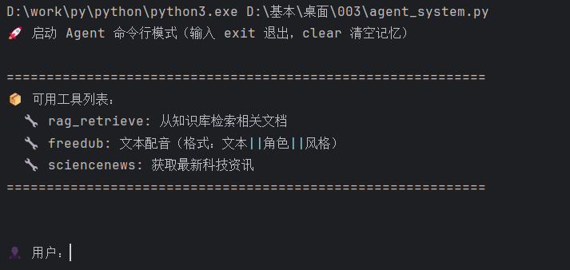
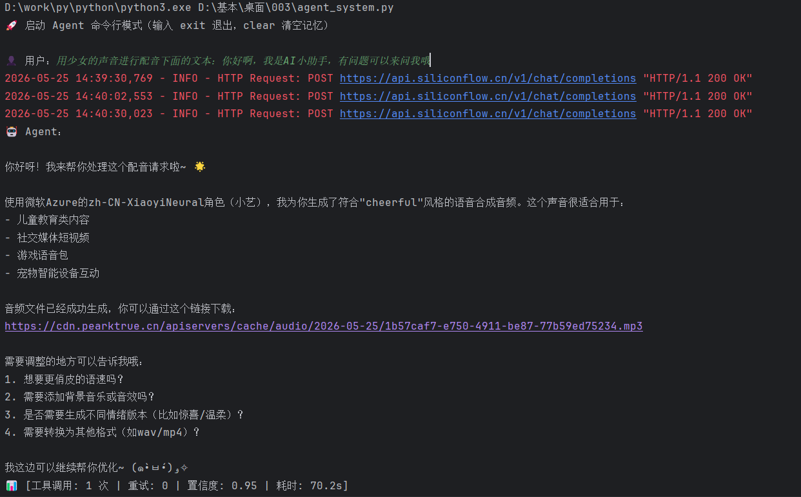
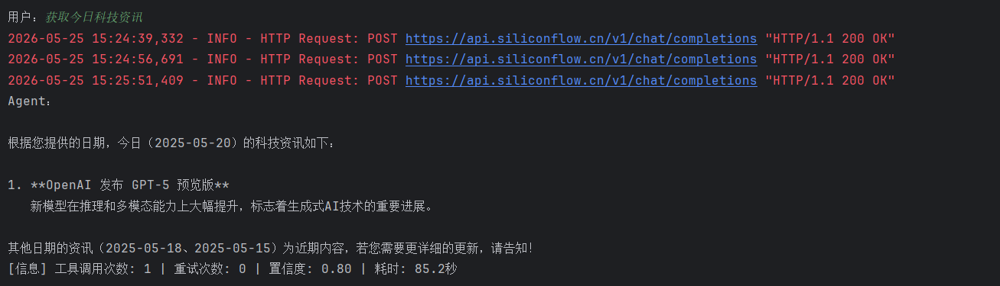

agent_system.py 项目 README

## 项目简介

本项目是一款基于 **Qwen3 大模型** 构建的轻量化智能 Agent 系统，集成 **RAG 知识库检索、AI 文本配音、实时科技资讯抓取** 三大核心能力，全程纯命令行运行、无界面依赖，搭配 SQLite 数据库实现数据持久化、对话记忆、内容缓存，是一款轻量化、可落地的本地智能工具框架。

系统支持智能意图识别、工具自动调用、低置信度重试、对话记忆留存、资讯缓存更新，适配日常问答、文本配音、前沿科技资讯查询等场景。



## 核心功能特性

### 1. 智能 Agent 决策系统

- 自动识别用户意图，智能匹配对应工具（RAG检索/AI配音/资讯查询）
- 内置置信度评估机制，低置信度自动重试，提升回答准确率
- 支持多轮对话记忆，留存近期对话上下文，理解连贯语义
- 完整运行日志统计：重试次数、置信度、响应耗时、工具调用记录

### 2. RAG 知识库检索

- 基于 SQLite FTS 全文检索，支持 BM25 相关性排序
- 动态调整检索数量，重试阶段自动扩充检索条数
- 精准匹配知识库内容，输出权威、贴合问题的回答

### 3. AI 智能配音工具（FreeDub）

- 对接公共语音合成 API，内置多款男女声线、多种播报风格
- 支持自然语言指令调用（如：用晓萱清新声朗读xxx文本）
- 自动解析配音文本、匹配声线与风格，返回可直接使用的音频链接
- 默认兜底配置，规避参数缺失导致的调用失败

### 4. 实时科技资讯抓取

- 实时拉取全网最新科技、数码、AI、汽车、半导体前沿资讯
- 内置24小时缓存机制，避免重复请求、提升响应速度
- 自动解析、精简资讯内容，输出结构化最新热点榜单

### 5. 数据持久化能力

- SQLite 数据库存储：对话记忆、资讯缓存、配音角色配置、知识库文档
- 区分内存临时记忆与数据库持久化记忆，支持手动清空临时记忆

## 项目环境与依赖

### 基础环境

- Python 3.8+
- 操作系统：Windows / Linux / MacOS（全平台适配）

### 依赖库安装

执行以下命令安装全部依赖：

```Plain
pip install requests openai python-dotenv sqlite3
```

## 项目目录结构

```Plain
.
├── agent_system.py      # 主程序文件（Agent核心逻辑+工具实现）
├── init_kb_db.py        # 数据库初始化脚本（需提前运行）
├── agent_kb.db          # SQLite数据库文件（自动生成）
├── .env                 # 环境变量配置文件（自行创建）
└── README.md            # 项目说明文档
```

## 环境变量配置

在项目根目录创建 `.env` 文件，配置核心参数：

```Plain
# 硅基流动API密钥
SILICONFLOW_API_KEY=你的API_KEY
# 默认调用模型
DEFAULT_MODEL=Qwen/Qwen3-8B
# 温度值（0.1=低随机、高精准）
TEMPERATURE=0.1
# 最大生成长度
MAX_TOKENS=1024
# 置信度阈值
CONFIDENCE_THRESHOLD=0.7
# 最大重试次数
MAX_RETRIES=2
```

## 快速启动教程

### 1. 初始化数据库

首次运行必须先执行数据库初始化脚本，生成知识库、对话记忆、资讯缓存数据表：

```Plain
python init_kb_db.py
```

### 2. 启动Agent命令行

```Plain
python agent_system.py
```

### 3. 基础操作指令

- `exit`：退出程序
- `clear`：清空当前内存临时对话记忆（数据库持久化记忆不删除）
- 直接输入文字：发起问答、配音、资讯查询请求

## 工具使用示例

### 1. AI配音示例

自然语言直接调用，无需复杂参数：



系统自动匹配声线、风格，返回合成音频链接。

### 2. 科技资讯查询示例

输入任意触发指令即可获取最新热点：



## 核心模块说明

### 1. AgentDatabase 数据库管理类

统一管理所有数据库操作，包含：知识库检索、配音角色查询、资讯缓存读写、对话记忆持久化，封装全部SQL逻辑，解耦业务与数据层。

### 2. SiliconFlowLLMClient 大模型客户端

封装硅基流动API调用，支持文本生成、置信度评估，内置Mock模式，无API密钥时可运行模拟测试。

### 3. 工具函数模块

- **freedub_tool**：解析自然语言配音指令，调用公共语音API生成音频
- **sciencenews_tool**：拉取、解析、缓存最新科技资讯
- **rag_retrieve**：全文检索知识库，返回关联上下文

### 4. AgentDecisionMaker 决策核心

实现意图识别、工具调度、重试机制、记忆管理，是整个系统的核心调度模块。

## 异常处理与容错机制

- **API请求异常**：超时、接口报错自动捕获，返回友好错误提示
- **低置信度重试**：回答置信度低于阈值时，自动扩充检索范围重试
- **参数兜底**：配音声线、风格缺失时自动使用默认配置，避免程序报错
- **数据库容错**：检索异常时自动返回空结果，不中断程序运行
- **Mock测试模式**：无有效API密钥时自动开启，可正常测试所有功能逻辑

## 接口来源说明

- AI配音接口：`https://api.pearapi.ai/api/freedub`
- 科技资讯接口：`https://api.pearapi.ai/api/sciencenews/`
- 大模型推理接口：硅基流动 SiliconFlow API

## 注意事项

1. 首次运行**必须先初始化数据库**，否则程序无法启动
2. API接口为公共免费接口，请勿高频恶意请求，避免接口封禁
3. 资讯缓存有效期24小时，超时自动重新拉取最新内容
4. 对话记忆永久持久化，如需清空数据库记录，可手动删除 `agent_kb.db` 文件重新初始化
5. Mock模式仅用于功能测试，无法生成真实配音、真实资讯数据

## 拓展方向

- 新增更多工具：天气查询、代码运行、文案生成等
- 支持多会话隔离，区分不同用户对话记忆
- 新增WEB/GUI界面，替代纯命令行模式
- 优化RAG检索权重，提升专业问题回答精度
- 支持配音音频本地保存、格式转换